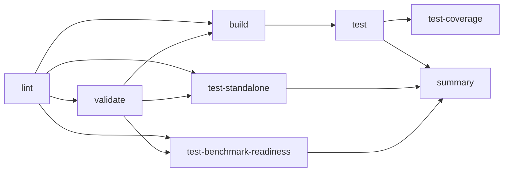

# CI 测试配置文档

## 概述

NeuroMem 项目使用 GitHub Actions 实现全面的 CI/CD 测试流程，覆盖所有测试类型。

## 测试架构

### 测试分类

```
tests/
├── unit/                    # 单元测试 (19 files)
│   ├── neuromem/
│   │   ├── indexes/        # 索引测试 (3 files)
│   │   └── services/       # 服务测试 (13 files)
│   └── test_*.py
├── integration/            # 集成测试 (3 files)
│   └── services/
├── e2e/                    # 端到端测试 (1 file)
│   └── test_complete_workflows.py
├── components/             # 组件测试 (6 files)
│   └── sage_mem/
├── performance/            # 性能测试 (1 file)
│   └── test_benchmarks.py
├── benchmarks/             # Benchmark统计 (1 file)
│   └── test_statistics.py
└── test_*.py               # 根级别测试 (7 files)
```

**总计**: 38 个测试文件

## CI Workflow 配置

### 工作流程阶段



### 1. Code Quality (lint)

**任务**: 运行 pre-commit 代码质量检查

**工具**:
- ruff (linting & formatting)
- isort (import sorting)
- trailing-whitespace removal
- end-of-file-fixer

**失败处理**: 提供详细的本地复现指南

### 2. Package Validation (validate)

**任务**: 验证 package 配置

**检查项**:
- `pyproject.toml` 格式和内容
- Python 文件语法检查（所有 `.py` 文件）

### 3. Build Check (build)

**任务**: 测试 package 构建

**步骤**:
- 构建 wheel 和 sdist
- 使用 twine 检查 package 元数据

### 4. Test Suite (test)

**任务**: 全面测试套件（多 Python 版本 + 多测试类型）

**测试矩阵**:
```yaml
Python 版本: [3.10, 3.11, 3.12]
测试类型:
  - Unit Tests (tests/unit)
  - Integration Tests (tests/integration)
  - E2E Tests (tests/e2e)
  - Component Tests (tests/components)
  - Performance Tests (tests/performance)
  - Root Tests (tests/test_*.py)
```

**总测试组合**: 3 (Python versions) × 6 (test types) = **18 个测试任务**

**特点**:
- `fail-fast: false` - 即使某个测试失败也继续运行其他测试
- `continue-on-error: true` - 测试失败不阻塞 pipeline
- 所有测试安装完整依赖：`pip install -e .[dev,benchmark]`

### 5. Standalone Tests (test-standalone)

**任务**: 测试不依赖 package 安装的功能

**目标**: 验证核心功能可独立运行

**测试文件**: `tests/test_neuromem_standalone.py`

### 6. Benchmark Readiness (test-benchmark-readiness)

**任务**: 验证 benchmark 环境和依赖

**步骤**:
1. 安装 benchmark 依赖：`pip install -e .[benchmark]`
2. 下载 Locomo 数据集
3. 运行 benchmark 就绪性测试

**测试文件**: `benchmarks/test_benchmark_readiness.py`

**验证内容**:
- 数据加载器 (Locomo, MemAgentBench, LongMemEval)
- NeuroMem 核心 API
- Pipeline 组件导入

### 7. Test Coverage (test-coverage)

**任务**: 生成测试覆盖率报告

**依赖**: 需要 test job 完成

**输出**:
- Coverage XML (上传到 Codecov)
- Coverage HTML (作为 artifact 保存 7 天)
- Terminal 覆盖率报告

**目标包**: `sage.neuromem`

### 8. Test Summary (summary)

**任务**: 汇总所有测试结果

**依赖**: 所有关键测试

**成功条件**:
```
✅ Code Quality
✅ Package Validation
✅ Build Check
✅ Standalone Tests
```

**注意**: Test Suite 和 Benchmark Readiness 允许失败（软检查）

## 本地测试指南

### 运行所有测试

```bash
# 安装依赖
pip install -e .[dev,benchmark]

# 运行所有测试
pytest tests/ -v

# 运行特定类型测试
pytest tests/unit -v                  # 单元测试
pytest tests/integration -v            # 集成测试
pytest tests/e2e -v                    # E2E测试
pytest tests/performance -v            # 性能测试
```

### 使用 Pytest Markers

```bash
# 运行带标记的测试
pytest -m unit                         # 仅单元测试
pytest -m "integration or e2e"         # 集成和E2E测试
pytest -m "not slow"                   # 排除慢速测试

# 使用 marker 过滤
pytest -k "test_memory_manager"        # 包含关键字的测试
```

### 生成覆盖率报告

```bash
# 安装覆盖率工具
pip install pytest-cov coverage[toml]

# 生成覆盖率
pytest tests/ \
  --cov=sage.neuromem \
  --cov-report=html \
  --cov-report=term

# 查看报告
open htmlcov/index.html
```

### 验证 Benchmark 就绪性

```bash
# 安装 benchmark 依赖
pip install -e .[benchmark]

# 下载数据集
python -m sage.data.sources.locomo.download

# 运行验证
python benchmarks/test_benchmark_readiness.py
```

### 本地 Pre-commit 检查

```bash
# 一次性安装
pip install pre-commit
pre-commit install

# 运行检查（与CI完全一致）
pre-commit run --all-files

# 自动修复
ruff check --fix .
ruff format .
```

## Pytest 配置

### pytest.ini

```ini
[pytest]
python_files = test_*.py
python_classes = Test*
python_functions = test_*

markers =
    unit: Unit tests
    integration: Integration tests
    e2e: End-to-end tests
    benchmark: Benchmark tests
    performance: Performance tests
    slow: Slow tests
    gpu: Tests requiring GPU
    cpp: Tests for C++ bindings

testpaths = tests

addopts =
    -v
    --strict-markers
    --tb=short
    --disable-warnings
```

## 依赖管理

### Dev 依赖

```toml
[project.optional-dependencies]
dev = [
    "pytest>=7.0.0",
    "pytest-cov>=4.1.0",
    "pytest-asyncio>=0.21.0",
    "ruff>=0.1.0",
    "pre-commit>=3.0.0",
]
```

### Benchmark 依赖

```toml
benchmark = [
    "isage-data>=0.1.0",
    "pytest-benchmark>=4.0.0",
    "pandas>=2.0.0",
    "datasets>=2.0.0",
]
```

## CI 触发条件

```yaml
on:
  push:
    branches: [main-dev, feat/*]
  pull_request:
    branches: [main-dev]
  workflow_dispatch:  # 手动触发
```

## 并发控制

```yaml
concurrency:
  group: ${{ github.workflow }}-${{ github.ref }}
  cancel-in-progress: true  # 取消同分支的旧运行
```

## 超时配置

| Job | Timeout |
|-----|---------|
| lint | 10 min |
| validate | 10 min |
| build | 15 min |
| test | 20 min |
| test-standalone | 10 min |
| test-benchmark-readiness | 10 min |
| test-coverage | 15 min |
| summary | 5 min |

## 故障排查

### 测试失败

1. **查看 CI 日志**: 点击失败的 job 查看详细输出
2. **本地复现**: 使用相同的 Python 版本和命令
3. **检查依赖**: 确保 `pyproject.toml` 依赖完整

### Pre-commit 失败

```bash
# 查看失败原因
pre-commit run --all-files --show-diff-on-failure

# 自动修复大多数问题
ruff check --fix .
ruff format .
```

### Import 错误

```bash
# 重新安装 package
pip install -e .[dev,benchmark]

# 验证 namespace
python -c "import sage.neuromem; print(sage.neuromem.__version__)"
```

### Benchmark 数据集问题

```bash
# 重新下载数据集
rm -rf ~/.sage/data/locomo
python -m sage.data.sources.locomo.download

# 验证数据
python -c "from sage.data.sources.locomo import load_locomo_dataset; print(len(load_locomo_dataset()))"
```

## 最佳实践

### 编写测试

1. **使用 Markers**: 为测试添加合适的标记
   ```python
   import pytest
   
   @pytest.mark.unit
   def test_memory_manager():
       pass
   
   @pytest.mark.integration
   def test_collection_workflow():
       pass
   ```

2. **独立性**: 每个测试应该独立运行
3. **清理**: 使用 fixtures 管理资源清理
4. **文档**: 添加清晰的 docstring

### 提交前检查

```bash
# 1. 运行 pre-commit
pre-commit run --all-files

# 2. 运行受影响的测试
pytest tests/unit/test_modified_module.py -v

# 3. 验证 build
python -m build

# 4. 提交
git commit -m "feat: add new feature"
```

### CI 优化建议

1. **使用缓存**: `cache: 'pip'` 已启用
2. **并行测试**: 测试矩阵自动并行运行
3. **快速失败**: 关键测试失败时立即终止
4. **增量测试**: 仅运行受影响的测试（未来优化）

## 参考资源

- **GitHub Actions**: https://docs.github.com/en/actions
- **Pytest**: https://docs.pytest.org/
- **Pre-commit**: https://pre-commit.com/
- **Coverage.py**: https://coverage.readthedocs.io/

## 版本历史

| 版本 | 日期 | 变更 |
|------|------|------|
| 1.0 | 2024-01 | 初始版本 - 全面测试覆盖 |

---

**维护者**: NeuroMem Team  
**最后更新**: 2024-01-XX
